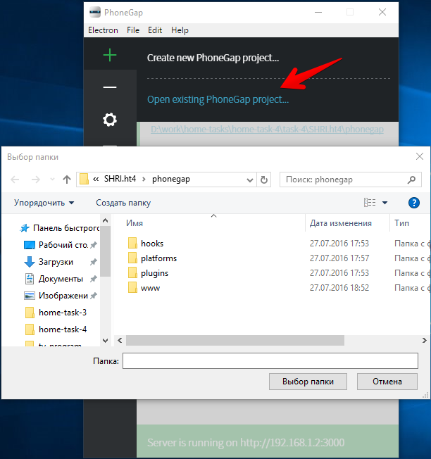
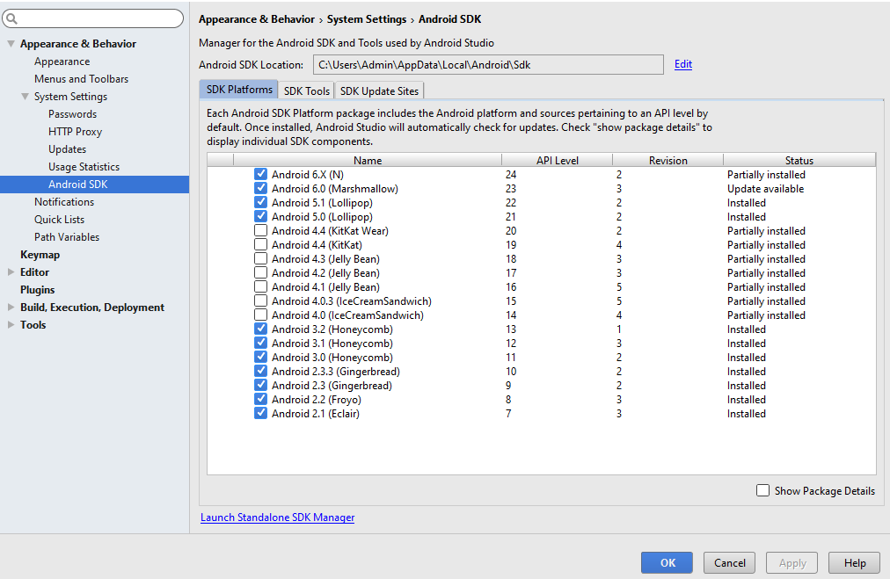
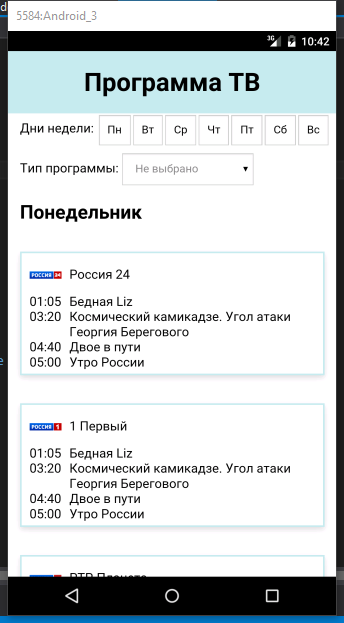
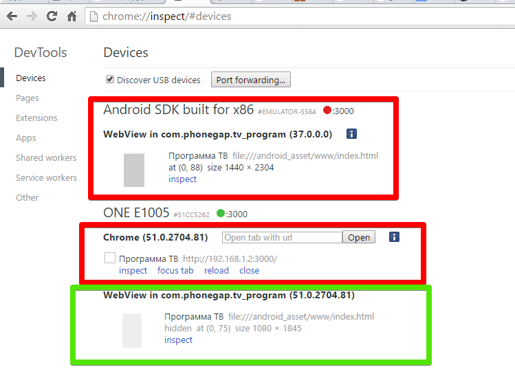
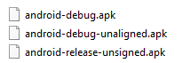
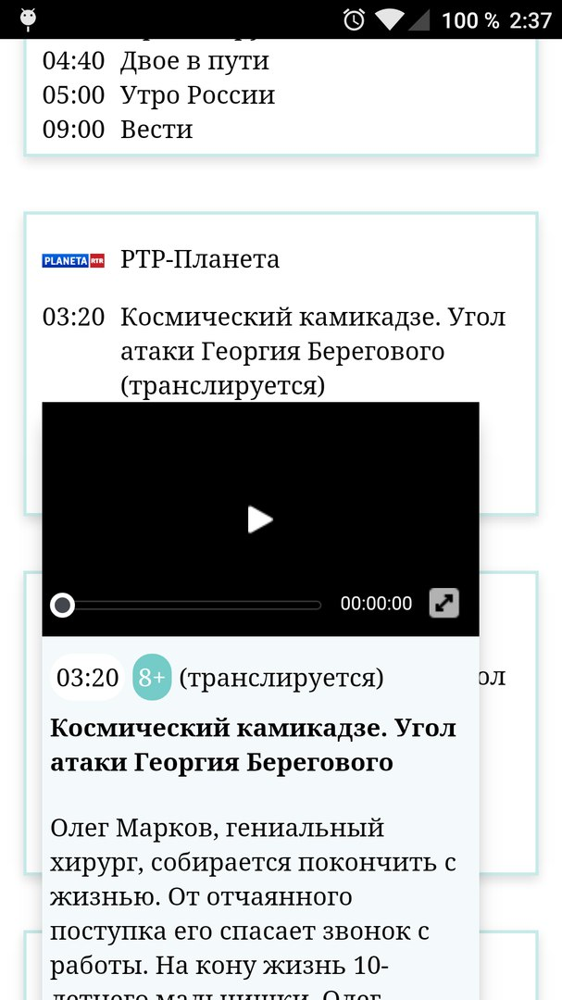
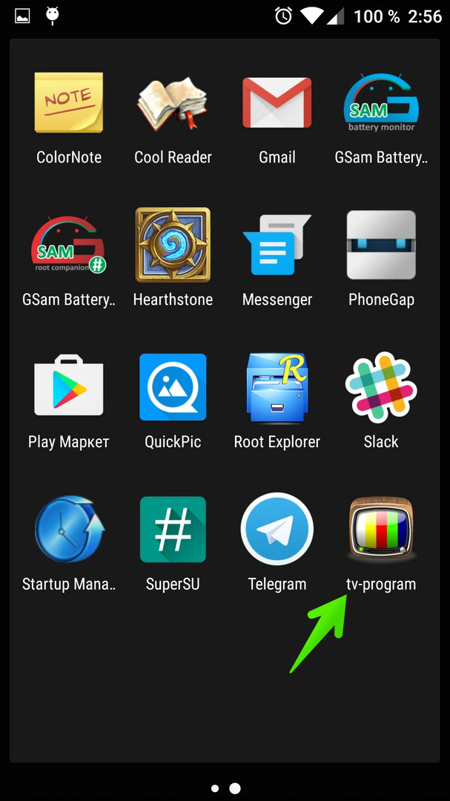
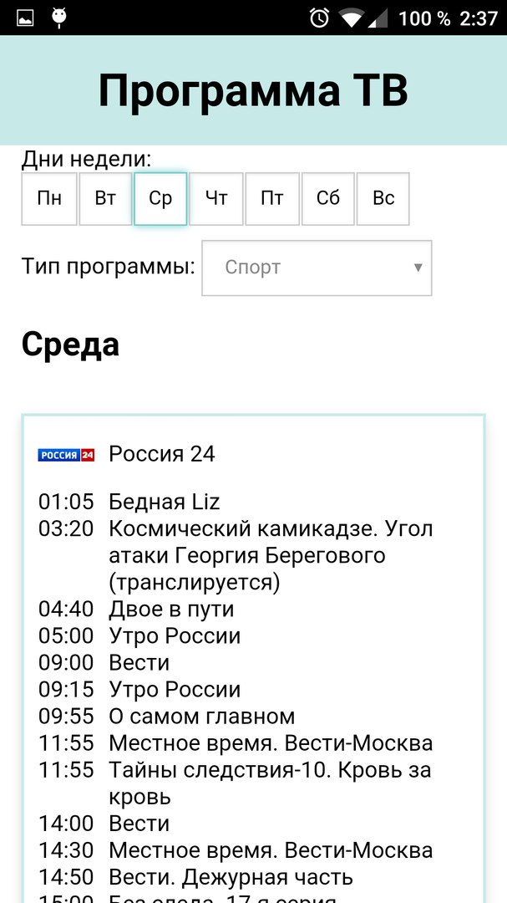

#Оглавление

##Задание

- Куда и когда присылать работы

- Ссылки

- Плагины

- Библиотеки и фреимворки

##Результаты выполнения домашней работы

- Установка и настройка

- Отладка

- Сборка

- Разработка

- Использование IndexedDB

- Проблемы с IndexedDB

- Рефакторинг

- Результат

# ДЗ №4: приложение с использованием PhoneGap

**Задание**

Создать любое своё приложение с использованием PhoneGap.

Например, завернуть телепрограмму из вступительного задания.

Собрать и поставить на свой телефон. Попробовать поставить на какой-то эмулятор.

Использовать один из сторонних плагинов. Например, indexdb.

Бонусом будет использование сторонних библиотек или фреимворков. Можно собрать несколько приложений с разными фреимворками.

**Результаты работы** :

- код на GitHub
- пакеты приложений на GitHub
- отчёт о работе: что сделано (со скриншотами), какие проблемы возникли

**Куда и когда присылать работы**

- Работы присылать на veged@yandex-team.ru
- Тема: «ДЗ по PhoneGap (фамилия и имя)»
- Срок — до 28 июля, 12:00

**Ссылки**

- [http://phonegap.com/](http://phonegap.com/)
- [http://phonegap.com/blog/2012/03/19/phonegap-cordova-and-what-e2-80-99s-in-a-name/](http://phonegap.com/blog/2012/03/19/phonegap-cordova-and-what-e2-80-99s-in-a-name/)

**Плагины**

- [http://cordova.apache.org/plugins/](http://cordova.apache.org/plugins/)
- [https://www.npmjs.com/browse/keyword/cordova](https://www.npmjs.com/browse/keyword/cordova)
- [https://www.npmjs.com/browse/keyword/phonegap](https://www.npmjs.com/browse/keyword/phonegap)

**Библиотеки и фреимворки**

- [http://getbootstrap.com](http://getbootstrap.com/)
- [http://goratchet.com](http://goratchet.com/)
- [https://ru.bem.info/libs/bem-components](https://ru.bem.info/libs/bem-components)
- [http://www.material-ui.com/](http://www.material-ui.com/)
- [http://jquerymobile.com](http://jquerymobile.com/)
- [https://onsen.io](https://onsen.io/)
- [http://ionicframework.com](http://ionicframework.com/)
- [http://framework7.io](http://framework7.io/)
- [https://www.sencha.com/products/touch/](https://www.sencha.com/products/touch/)

# Результаты выполнения домашней работы

##Установка и настройка

Первое что было сделано - это последовательное выполнение шагов на официальном сайте phonegap - [http://phonegap.com/getstarted/](http://phonegap.com/getstarted/)

Тестовые приложения были созданы десктопной версией для windows.

Для задания, было создано пустое (без лишних плагинов и кода, которые тянет десктопное приложение при создании нового) приложение через консоль: phonegap create tv-program --template blank

После чего, созданное phonegap приложение можно открыть в приложении для windows

и запустить с указанным IP ( [http://192.168.1.2:3000](http://192.168.1.2:3000)).

Так же было установлено приложение для android с помощью которого можно было легко подключиться к этому IP адресу и посмотреть работу приложения.

Было установлено android sdk для эмуляции различных устройств, с различными операционными системами.(рис.2)

для запуска виртуального устройства командой cordova run android

для запуска на реальном устройстве командой cordova run android --device

необходимо было еще поставить (помимо sdk) Java SE Development Kit 8u101, если поставить версию 7, то ошибки при запуске будут продолжаться.

рис.2 настройка android SDK.

Отладка проводилась на виртуальном устройстве (рис.3) 

рис.3 виртуальное устройство Nexus

##Отладка

Для комфортной разработки естественно нужно отлаживать приложение, причем работа на устройстве и в браузере очень часто отличается.

Андройд в этом плане очень даже дружелюбен к разработчикам, и для нормальной отладки и выявления ошибок (например когда использовал indexedDb) достаточно иметь chrome, и настроить chrome://inspect (рис.4)

 

рис.4 отладка на различных устройствах android

##Сборка

Для того чтобы собрать приложение в .apk файл, необходимо установить платформу:

cordova platform add android

и собрать приложение:

cordova build или cordova build --release

в результате чего получим собранные файлы в ..\platforms\android\build\outputs\apk\

(рис.5)

 

рис.5 собранные файлы для android

# Разработка

##Использование IndexedDB

В работе использовался способ постоянного хранения данных внутри клиентского браузера с помощью indexedDB. В тв программе создается клиентская база &quot;SourceTvDb&quot; и помещаются в хранилище данные для телепрограммы.

Если данных нет, то они берутся из SourceService.js

И в дальнейшем используется get запрос для получения данных из базы.

Все методы которые обращаются к базе обернуты в Promise, таким образом мы избавляемся от передачи callback&#39;ов.

##Проблемы с IndexedDB

В современных браузерах indexedDB работает безотказно, но для WebView необходимо использовать polyfill.

Для решения этой проблемы и быстрого решения очень помогла отладка с chrome://inspect

##Рефакторинг

Был так же проведен рефакторинг приложения Tv-program для адаптации под мобильный экран, и разнесены source данные по отдельным файлам. Исправлены недочеты с логикой фильров.

# Результат

- Создано приложение tv-program с помощью PhoneGap
- Собрано и поставлено на телефон (рис 6, рис 7, рис 8)
- Собрано на эмуляторе
- Для получения и хранения данных использован IndexedDb

 
 
 
